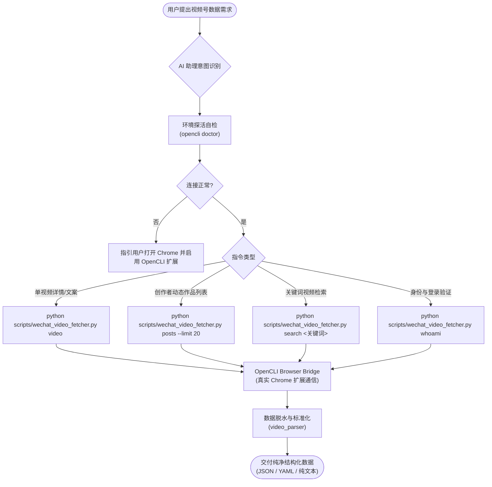

# 微信视频号 OpenCLI 数据获取助手 (Skill: skill-wechat-video-opencli-fetcher)

> **公开 GitHub 仓库**：[https://github.com/JasonCai2024/skill-wechat-video-opencli-fetcher](https://github.com/JasonCai2024/skill-wechat-video-opencli-fetcher)  
> **一键克隆仓库**：
> ```bash
> git clone https://github.com/JasonCai2024/skill-wechat-video-opencli-fetcher.git
> ```

---

## 📌 一、项目简介与技能定位

本技能基于 **本地 OpenCLI 守护进程 + 桌面 Chrome 真实浏览器扩展**，为终端用户与 AI 智能体提供安全合规的微信视频号（WeChat Channels）视频详情、脱水纯文本正文与历史动态数据提取能力。

### 🌟 3 大核心卖点：
- 🟢 **纯粹原始数据与脱水文案**：专攻高价值核心原始数据——**标题、发布时间、视频链接、封面图、播放量/点赞/评论/转发互动指标、纯文本脱水文案**。彻底剥离所有 HTML 标签与排版样式，段落自然分明；
- 🟢 **终身免维护 Cookie**：直接继承日常桌面 Chrome 浏览器的真实会话，告别频繁失效的抓包 Cookie 与复杂逆向签名；
- 🟢 **零风控封禁风险**：原生真实桌面浏览器环境与指纹特征，非模拟 HTTP 爬虫协议，稳定可靠且支持一键探活。

---

## 🔄 二、Mermaid 业务流程图



---

## 🛠️ 三、获取与安装配置

### 1. 环境依赖要求
- **Node.js**: `>= 18.0.0`
- **Python**: `>= 3.8`
- **Google Chrome**: 桌面最新稳定版

### 2. 安装 OpenCLI
本技能基于开源工具 `@jackwener/opencli` 运行：
```bash
npm install -g @jackwener/opencli
```

### 3. 安装并启用 Chrome 浏览器扩展
- **途径 A（Chrome 网上应用店）**：在 Chrome Web Store 中搜索并安装 `OpenCLI` 插件，将其固定在浏览器工具栏并开启；
- **途径 B（本地一键安装）**：在终端运行 `opencli extension install`，在 Chrome 地址栏打开 `chrome://extensions/` 勾选开发者模式并“加载已解压的扩展程序”。

### 4. 安装 Python 依赖
```bash
pip install -r requirements.txt
```

### 5. 一键健康探活
在终端执行：
```bash
python scripts/wechat_video_fetcher.py doctor
```
看到 `✅ [OK] OpenCLI 真实浏览器桥接环境完全就绪！` 即表示全链路准备完毕。

---

## ⚡ 四、使用说明

### 1. 能做什么与怎么对 AI 助理说

| 能力名称 | 自然语言提示词触发话术 | 底层 CLI 执行命令 |
|---|---|---|
| 🎬 **单视频详情提取** | *“帮我把这个视频号作品的详情和点赞数提取出来：`<视频链接>`”* | `python scripts/wechat_video_fetcher.py video "<URL>" -f json` |
| 📝 **提取脱水纯文本正文** | *“提取这个视频号的文案，直接输出纯文本”* | `python scripts/wechat_video_fetcher.py video "<URL>" --text-only` |
| 🖨️ **终端友好排版直出** | *“查看这篇视频号的内容和互动数据”* | `python scripts/wechat_video_fetcher.py video "<URL>" -f plain` |
| 📚 **创作者作品动态列表** | *“查看我视频号最新发布的 20 条动态作品数据”* | `python scripts/wechat_video_fetcher.py posts --limit 20` |
| 📦 **作品列表 + 全量正文** | *“拉取最新的 10 条动态并将完整文案保存为 json 文件”* | `python scripts/wechat_video_fetcher.py posts --limit 10 --with-content -o posts.json` |
| 🔍 **全网视频关键词搜索** | *“在微信上搜一下关于‘DeepSeek 智能体’的视频”* | `python scripts/wechat_video_fetcher.py search "DeepSeek 智能体" --limit 10` |
| 👤 **创作者登录态查询** | *“检查当前视频号登录账号信息”* | `python scripts/wechat_video_fetcher.py whoami` |
| 🩺 **环境探活与健康自检** | *“检查微信视频号数据采集环境是否正常”* | `python scripts/wechat_video_fetcher.py doctor` |

### 2. 典型实战场景工作流

#### 场景 1：单视频深度解析与文案提炼
1. 用户在微信中复制任意视频号分享链接或文本：`微信视频号分享：【普通人AI怎么选？】https://channels.weixin.qq.com/web/pages/feed?...`；
2. AI 助理调用 `python scripts/wechat_video_fetcher.py video "<链接>" -f json`；
3. 系统自动解析出规范标题、作者、发布时间、视频源、高清封面、点赞转发评论指标以及脱水文案正文，供后续摘要、改写或分发。

#### 场景 2：创作者个人作品复盘与多维数据统计
1. 用户希望复盘自己视频号近期的作品互动情况；
2. AI 助理运行 `python scripts/wechat_video_fetcher.py posts --limit 20 -o recent_posts.json`；
3. 输出包含每部作品的播放量 (`read_count`)、点赞数 (`like_count`)、评论数 (`comment_count`) 与发布时间，支持一键生成数据复盘报表。

#### 场景 3：全网热点与话题视频检索
1. 用户希望了解某个前沿话题在视频号上的讨论动态；
2. AI 助理运行 `python scripts/wechat_video_fetcher.py search "多模态大模型" --limit 5`；
3. 输出相关热门视频与内容概览，助力选题策划。

---

## 🔒 五、凭证安全与隔离规范

1. **零敏感凭证上云**：本技能绝不向任何第三方云服务上传您的账号密码或登录 Cookie；
2. **物理隔离环境**：本地通过 `.gitignore` 严格忽略 `.env`、`data/credentials.json`、日志以及所有本地凭证缓存文件；
3. **安全配置样例**：根目录仅提供 `.env.example` 供环境配置参考，杜绝凭证泄露风险。

---

## 📁 六、文件目录结构与核心设计决策

### 1. 文件树
```text
skill-wechat-video-opencli-fetcher/
├─ .env.example                          # 环境变量配置模板
├─ .gitignore                            # 忽略临时文件与本地凭证
├─ CHANGELOG.md                          # 版本变更日志
├─ INSTALL.md                            # 详细安装与配置指南
├─ README.md                             # 仓库核心说明
├─ requirements.txt                      # Python 依赖项
├─ SKILL.md                              # AI 智能体标准技能说明书
├─ adapters/                             # OpenCLI 原生站点适配器
│  └─ wechat-channels/
│     ├─ posts.js                        # 视频号助手后台动态作品抓取适配器
│     └─ video.js                        # 单视频多维数据提取适配器
├─ references/                           # 详细技术手册
│  ├─ commands-reference.md              # 完整命令行与字段说明
│  ├─ setup-guide.md                     # 运行环境搭建指南
│  └─ troubleshooting.md                 # 常见报错与自愈排查指南
└─ scripts/                              # 运行与测试脚本
   ├─ _wechat_video_core/                # 核心内部实现包
   │  ├─ __init__.py                     # 核心包导出
   │  ├─ dispatcher.py                   # 统一调度器引擎 (双引擎保障与自动同步)
   │  └─ video_parser.py                 # 数据解析与纯文本脱水清洗器
   ├─ test_fetcher.py                    # 单元测试与环境探活验证脚本
   └─ wechat_video_fetcher.py            # 面向终端与 AI 的统一命令行外壳
```

### 2. 核心技术选型优势
- **适配器自动热同步 (`ensure_adapters_installed`)**：内置脚本自动将 `adapters/wechat-channels/` 下的最新适配器同步至 `~/.opencli/clis/wechat-channels/`，做到免手动安装、即插即用；
- **双引擎容灾机制**：单视频优先走轻量 OpenCLI 适配器命令；若遇异常或需深度渲染，自动降级切换至独立真实 Chrome 浏览器会话进行 DOM 穿透，保障高成功率；
- **彻底脱水清洗**：自研 `video_parser.py` 剥离全部 HTML 与内联噪音代码，保留自然段落与 `#话题` 结构，提供最高纯净度的输入语料。
