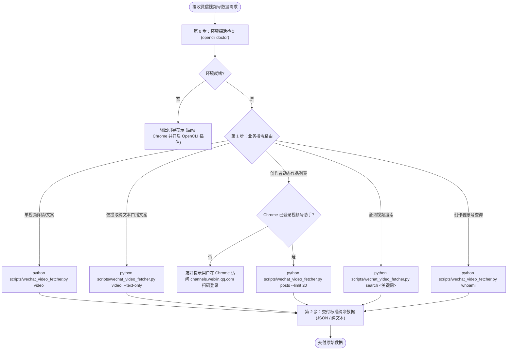

# 微信视频号 OpenCLI 数据获取助手 (Skill: skill-wechat-video-opencli-fetcher)

## Goal
指导 AI 助理通过本地 OpenCLI 守护进程与 Chrome 真实浏览器扩展，实现微信视频号（WeChat Channels）核心原始数据（单视频脱水纯文本正文与口播词、发布时间、创作者/视频号昵称、标题、视频播放源、封面地址、点赞/转发/评论/收藏互动指标；视频号助手后台历史动态作品列表）的自动化采集与清洗，做到**终身免维护 Cookie、零风控封禁风险、仅输出干净纯粹的原始数据**。

---

## Required Inputs
根据用户的具体视频数据获取需求，接收以下至少一种输入：
1. **视频号分享链接或文本**：如 `https://channels.weixin.qq.com/web/pages/feed?feedId=...` 或微信端复制的整段分享文本（包含 URL 即可，调度器自动提取与规范化）；
2. **作品批量获取参数**：拉取视频号助手后台作品动态列表时可选 `--limit`（默认 20 条）、`-q <关键词>`，以及可选 `--with-content` 一并拉取正文与视频流；
3. **关键词搜索内容**：如 `“DeepSeek 智能体”`，可选 `--limit`（默认 10 条）；
4. **输出控制参数**：可选 `-f json`（默认）、`-f yaml` 或 `-f plain`，可选 `--text-only` 仅直出文案，可选 `-o <文件路径>` 导出。

---

## Workflow



### 步骤 0：环境前置探活检查
AI 助理在首次调用前或怀疑连接异常时，可执行探活：
```bash
python scripts/wechat_video_fetcher.py doctor
```
- 若返回 `[OK] Connectivity: connected`，表示链路正常；
- 若提示插件断开，提醒用户保持桌面 Chrome 浏览器打开。

### 步骤 1：业务指令路由（统一 Python 外壳调度）
根据用户需求精准调用技能内置的 Python 调度脚本：

| 业务需求 | 🌟 推荐标准调用命令 | 说明 |
|---|---|---|
| **单视频原始数据详情** | `python scripts/wechat_video_fetcher.py video "<视频URL>"` | 提取标题、文案、创作者、发布时间、视频链接、封面、互动数据 |
| **仅提取口播/描述文案** | `python scripts/wechat_video_fetcher.py video "<视频URL>" --text-only` | 终端直接打印无排版噪音脱水纯文本 |
| **终端人类友好排版** | `python scripts/wechat_video_fetcher.py video "<视频URL>" -f plain` | 终端友好的键值区块展示 |
| **创作者作品动态列表** | `python scripts/wechat_video_fetcher.py posts --limit 20` | 批量获取自己视频号作品的播放量、点赞、评论等列表 |
| **作品列表+全量详情** | `python scripts/wechat_video_fetcher.py posts --limit 10 --with-content` | 批量获取动态并逐条提取完整正文与视频流 |
| **全网视频号搜索** | `python scripts/wechat_video_fetcher.py search "<关键词>" --limit 10` | 检索全网相关微信视频号内容 |
| **查询当前登录账号** | `python scripts/wechat_video_fetcher.py whoami` | 查看当前已登录的视频号身份信息 |
| **保存到本地文件** | 任意命令追加 `-o output.json` | 自动写入指定文件路径 |

### 步骤 2：数据交付规范
按照用户的核心要求，**只输出纯粹、干干净净的原始数据**，严禁掺杂未经请求的过度加工、排版噪音或冗长评论包装。

---

## Decision Rules

1. **原始数据纯净原则（核心）**：
   - 彻底脱水：文案内容必须剥离所有 HTML 标签（`<p>`, `<div>`, `<span>` 等）、内联 CSS 与乱码字符；
   - 保留自然分段：块级元素之间自然换行，压缩冗余空行，确保人类或后续大模型输入清晰可读；
   - 保留话题标签：提取 `#话题` 列表并保存在结构化字段中；
   - 发布时间规范：统一转换为标准 `YYYY-MM-DD HH:mm:ss`；
   - 统计数值归一化：将 `1.2万`、`10w` 归一化为整型数字。
2. **零风控真实浏览器借力原则**：
   - 数据抓取全部基于真实 Chrome 浏览器环境和 OpenCLI 扩展协议，复用本地真人指纹；
   - 无需开发者申请高门槛的企业 API，无需维护随时过期的 Cookie，消除封禁与风控拦截风险。
3. **创作者动态合规拉取原则**：
   - 批量拉取视频号动态时，借力已登录的视频号助手后台（`channels.weixin.qq.com`）；
   - 若遇到未登录提示，友好指引用户在 Chrome 中访问 `https://channels.weixin.qq.com/` 扫码登录即可。

---

## Output Requirements

### 1. 单视频数据输出结构 (JSON)
```json
{
  "title": "深入剖析 Agentic AI 落地架构与实践路径",
  "author": "AI技术观察",
  "author_id": "v2_060000231...",
  "publish_time": "2026-10-01 19:30:00",
  "video_url": "https://finder.video.qq.com/251/20302/stodownload?encfilekey=...",
  "cover_url": "https://finder.video.qq.com/251/20304/stodownload?encfilekey=...",
  "duration": 96,
  "stats": {
    "likes": 12800,
    "forwards": 3200,
    "comments": 650,
    "favs": 4100
  },
  "tags": [
    "AI",
    "智能体",
    "技术架构"
  ],
  "url": "https://channels.weixin.qq.com/web/pages/feed?feedId=export%2F...",
  "content": "深入剖析 Agentic AI 落地架构与实践路径。\n\n本期视频重点拆解自主智能体系统的四大核心模块：规划拆解、工具调用、长期记忆与自愈反思。普通开发者如何快速构建生产级智能体应用？\n\n#AI #智能体 #技术架构"
}
```

### 2. 动态作品列表输出结构 (JSON)
```json
[
  {
    "index": 1,
    "title": "深入剖析 Agentic AI 落地架构与实践路径",
    "create_time": "2026-10-01 19:30:00",
    "export_id": "export/UzFzN5PxR1vK9aQ2w...",
    "read_count": 89000,
    "like_count": 12800,
    "forward_count": 3200,
    "comment_count": 650,
    "status": "已发表",
    "cover_url": "https://finder.video.qq.com/...",
    "link": "https://channels.weixin.qq.com/web/pages/feed?feedId=export%2FUzFzN5PxR1vK9aQ2w...",
    "full_content": "深入剖析 Agentic AI 落地架构与实践路径..."
  }
]
```

---

## Validation
- [ ] `python scripts/wechat_video_fetcher.py doctor` 探活通过，Daemon 与 Extension 正常通信；
- [ ] 单视频提取输出包含非空的 `title` 或 `content`，以及 `video_url` 或 `cover_url`；
- [ ] `content` 中不包含任何 `<div...>` 等 HTML 标签或富文本代码；
- [ ] 作品动态列表抓取能正常返回作品的播放与互动统计数据。

---

## Fallback
- **若提示视频号助手未登录**：提示用户：“*请在已启用 OpenCLI 扩展的 Chrome 浏览器中访问 `https://channels.weixin.qq.com/` 扫码登录，登录后即可拉取历史作品动态。*”
- **若提示 Extension 未连接**：提示用户启动桌面 Chrome 浏览器并检查 OpenCLI 插件开关；
- **若视频提示已失效**：输出原始错误信息提示该视频可能已被作者删除或链接已失效。

---

## Examples

### 示例 1：提取单篇视频号口播文案与数据
- **用户 Prompt**：“帮我把这个视频号作品的口播文案和点赞数据提取出来：`https://channels.weixin.qq.com/web/pages/feed?feedId=...`”
- **助理行为**：
  1. 执行 `python scripts/wechat_video_fetcher.py video "https://channels.weixin.qq.com/web/pages/feed?feedId=..." -f json`；
  2. 直接交付包含标题、作者、发布时间、视频流、互动指标与脱水正文文案的结构化结果。

### 示例 2：批量查看自己视频号最新发布的 10 条动态数据
- **用户 Prompt**：“看下我视频号最近发布的 10 条视频播放量和点赞情况”
- **助理行为**：
  1. 执行 `python scripts/wechat_video_fetcher.py posts --limit 10 -f json`；
  2. 交付包含作品标题、发布时间、播放量、点赞数与评论数的清单。
